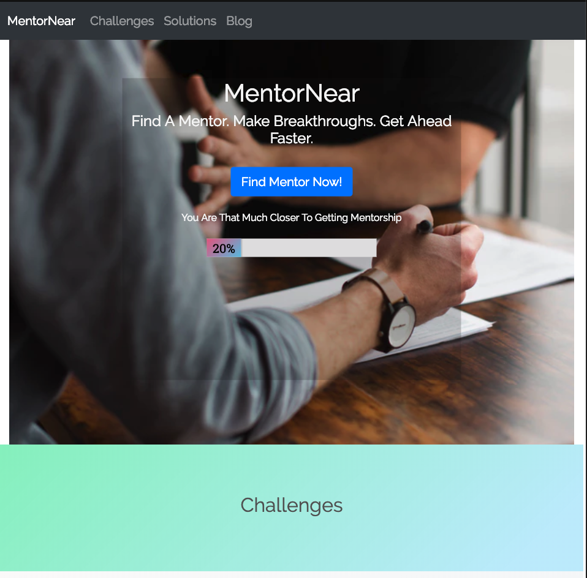
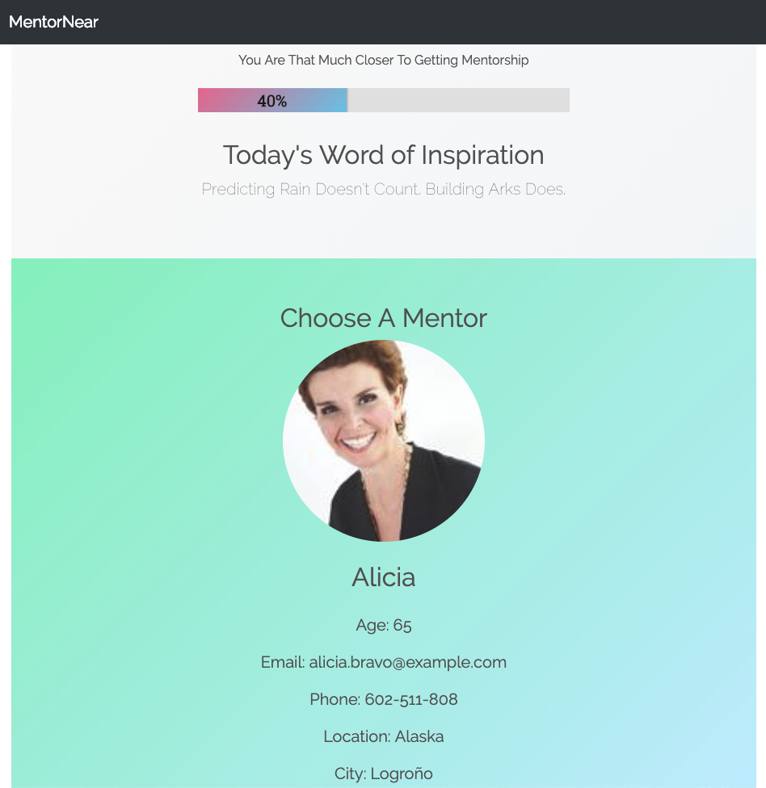
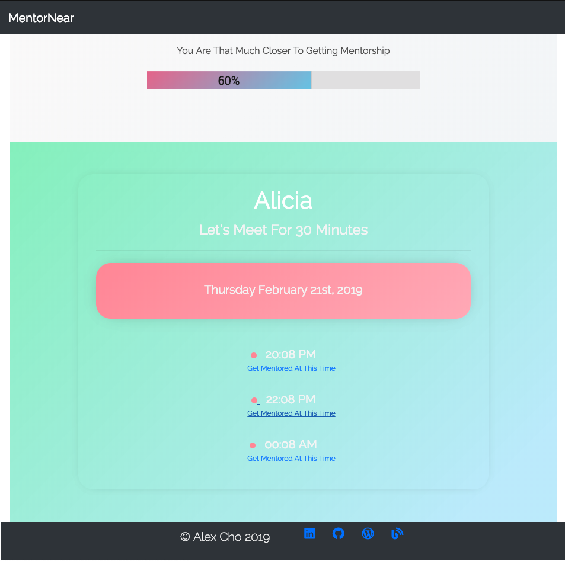
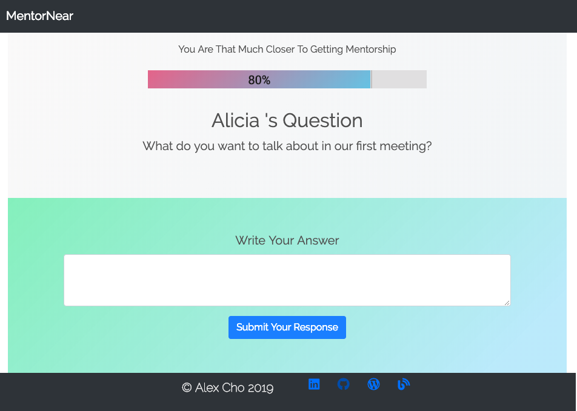
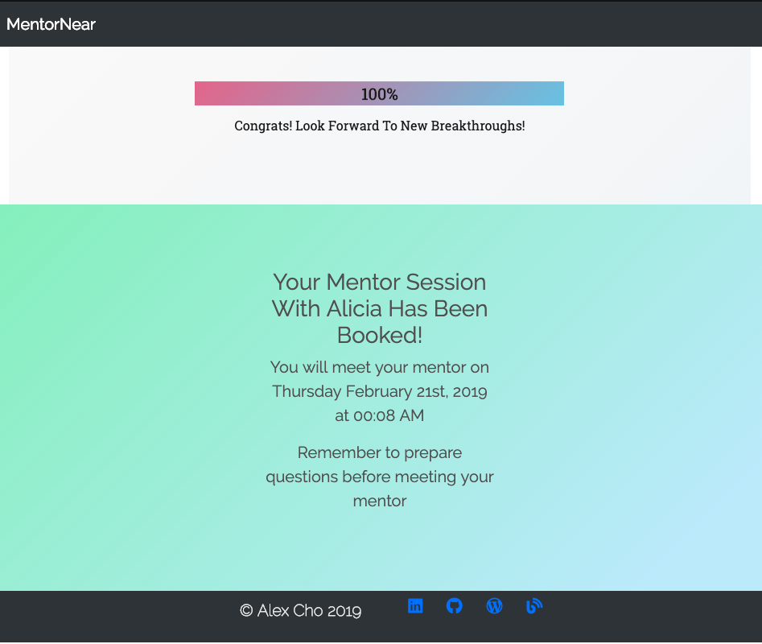

# MENTORNEAR MVP CONCEPT

[Link to Live Demo App ](https://alexsjcho.github.io/mentor-near-api-capstone/)

This is an MVP of this start-up concept of Mentorship service similar to a dating app like Tinder, CoffeeMeetsBagel, and shared economy concepts like Lyft and Uber.

However, due to the scope of this project, I was limited to only using 3rd party APIs, so it's not fully what it could be, but it's sufficient to demonstrate the app concept.

# PROJECT JOURNEY INSIGHTS

1. [Link to Live Demo App ](https://alexsjcho.github.io/mentor-near-api-capstone/)
2. [Qualified Product Development Roadmap Google Sheet ](https://docs.google.com/spreadsheets/d/1rEqcpEd8b2sCHKsGvMcy7s1Rh6V66-jFo1X5c5EcSOE/edit?usp=sharing)

# TECHNOLOGIES USED

1. HTML5
2. CSS3
3. Bootstrap
4. Normalize.css
5. Javascript
6. jQuery
7. 3rd Party APIs: [Random User Generator](https://randomuser.me/), [Random Quotes Generator](https://theysaidso.com/api/#random)
8. [Dates.js Library](https://github.com/datejs/Datejs)

# TESTING TOOLS

1. Chrome Dev Tools

# SUMMARY

## 1 Home Page

Designed like a regular SaaS App. Users are meant with a description of challenges and solutions MentorNear provides

## 2 Find Mentor Page

Users can cycle through several mentor profiles until they choose one.

## 3 Mentor Calendar Page

Users can find 30 minute time block on their mentor's calendar

## 4 Mentor Form Page

Users can answer mentor's question form to prepare for their meeting

## 5 Confirmation Page

Users get a confirmation that their mentor meeting has been booked

## CHALLENGES

1. **Priority Management**: Figuring out which features are worth the time and core to product.
2. **Time Management**: Keeping app within 1 week scope
3. **Focus with Limited Tools**: The focus of this app was to ultilize 3rd party APIs in a meaningful way, however, we were limited to just using JavaScript and jQuery, therefore, it was hard to accomplish the neatness and organization that comes with React.

## FUTURE IMPROVEMENTS

1. _Build A React App Version_: Using pure jQuery and JavaScript to accomplish this app was a nightmare, if I had attempted this project using React, the process would be neater, code more maintainable and readable for everyone.
2. _Use JavaScript Modules_: I was not experienced with JavaScript modules, therefore, all my JavaScript code lived in 1 file which made it really difficult to deal with

# MENTORS

1. [Justin Tieu - Software Engineer Eversight](https://www.linkedin.com/in/justintieu/)
